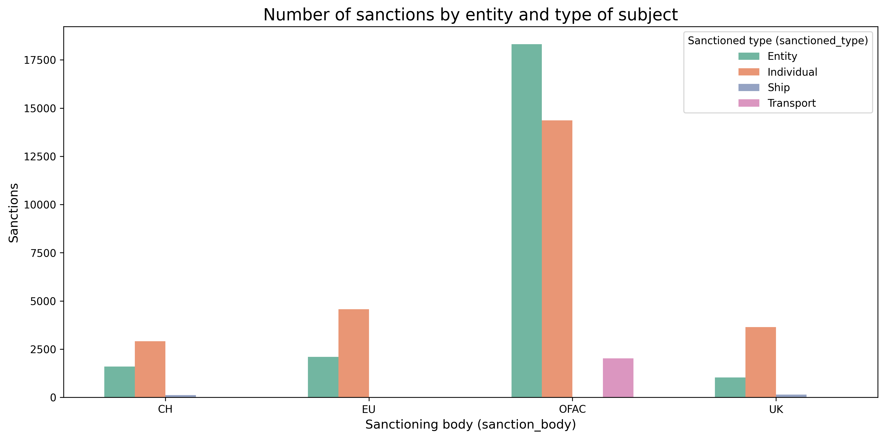
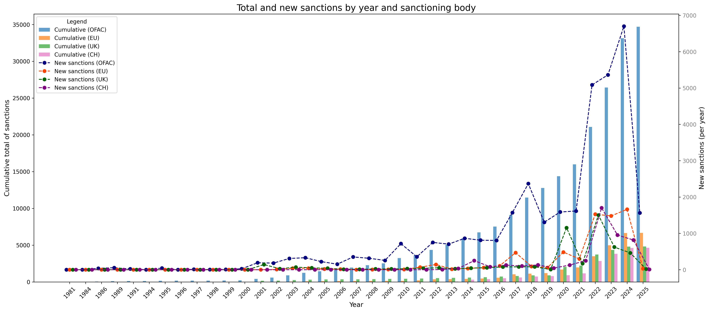

# International Sanctions Analysis

## Overview
This project is a case study focused on collecting sanctions data from major international sanctioning bodies (OFAC, EU, Switzerland, UK) and standardizing the downloaded data into CSV files.  
One of the main challenges and highlights of the project is handling the varying data formats (XML, HTML, CSV, XLSX) provided by the sources, demonstrating the required flexibility for data storage across different formats.

In the second part of the project, the code aggregates the standardized data and generates three example plots to illustrate the potential for analyzing this data. The plots are only examples and showcase the possibilities for deeper insights that could be derived from such a study.

---

## File Structure and Code Explanation
The repository consists of the following files:

- **`sanc_ch_analysis.ipynb`**: Standardizes and analyzes sanctions data from Switzerland.
- **`sanc_eu_analysis.ipynb`**: Standardizes and analyzes sanctions data from the European Union.
- **`sanc_ofac_analysis.ipynb`**: Standardizes and analyzes sanctions data from OFAC (US Office of Foreign Assets Control).
- **`sanc_uk_analysis.ipynb`**: Standardizes and analyzes sanctions data from the United Kingdom.
- **`sanc_plot_analysis.ipynb`**: Aggregates the data stored in CSV files and produces three example plots for analysis.
- **`functions.py`**: Contains custom functions required for data standardization.


---

## Example Plots
Below are three example plots generated from the aggregated sanctions data:

### Plot 1: Example Visualization

*This plot shows the count of each sanctioned subject type for each sanctioning body.*

### Plot 2: Example Visualization

*This is a mixed bar and trend plot.*  
*The bar plot: for each sanctioning body, cumulative sanctions per year.*  
*The trend plot: for each sanctioning body, new issued sanctions per year.*


These plots are designed to demonstrate the analytical possibilities of this study. They are illustrative and not exhaustive.

---

## Libraries and Installation
This project uses the following Python libraries:
- `pandas`
- `numpy`
- `os`
- `matplotlib`
- `seaborn`
- `openpyxl`
- `xml.etree.ElementTree`
- `requests`
- `bs4` (BeautifulSoup)
- `pycountry`
- `datetime`
- `re`
- `io`
- `time`
- `glob`
- `lxml`
  
To install all required libraries, run:
```bash
pip install pandas numpy os-sys matplotlib seaborn openpyxl requests beautifulsoup4 pycountry datetime regex Python-IO glob2 lxml
